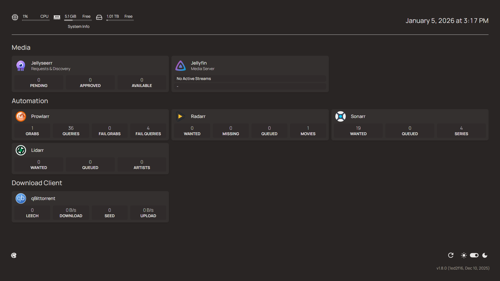
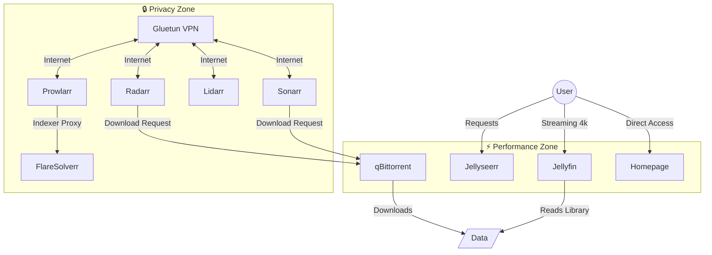
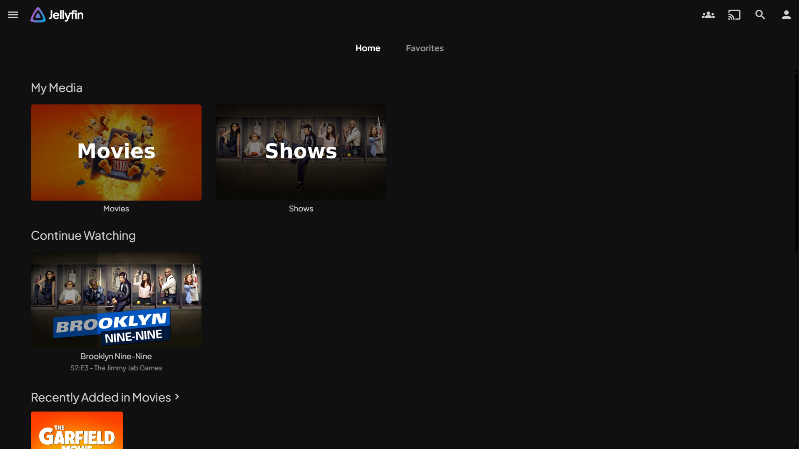
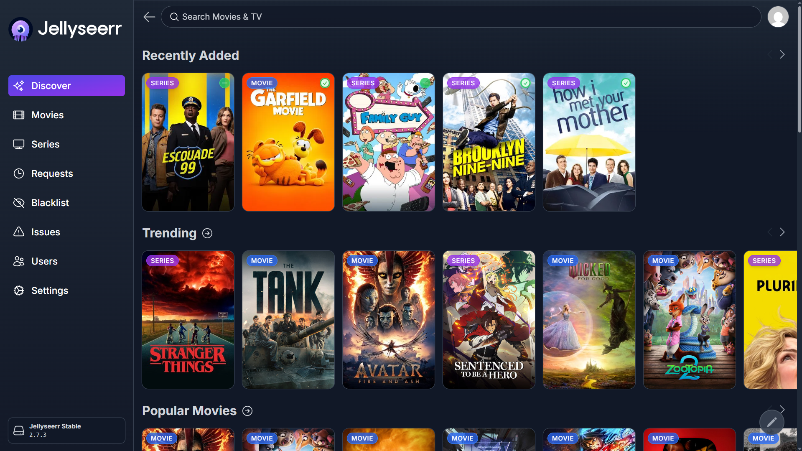
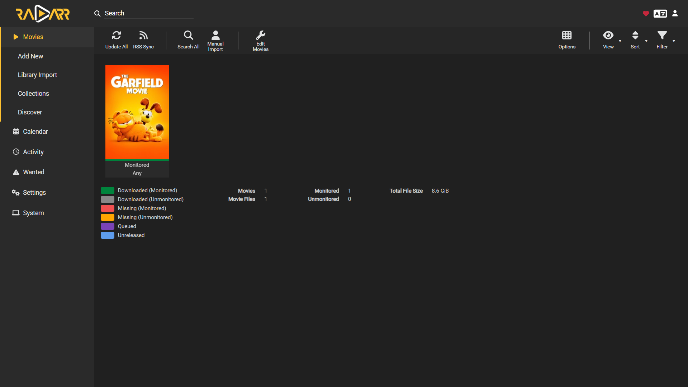
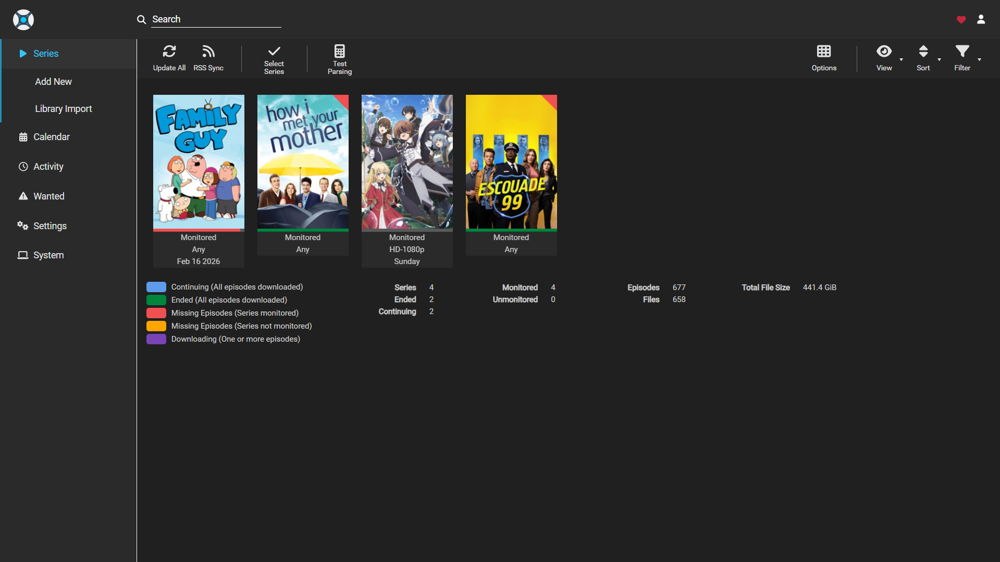
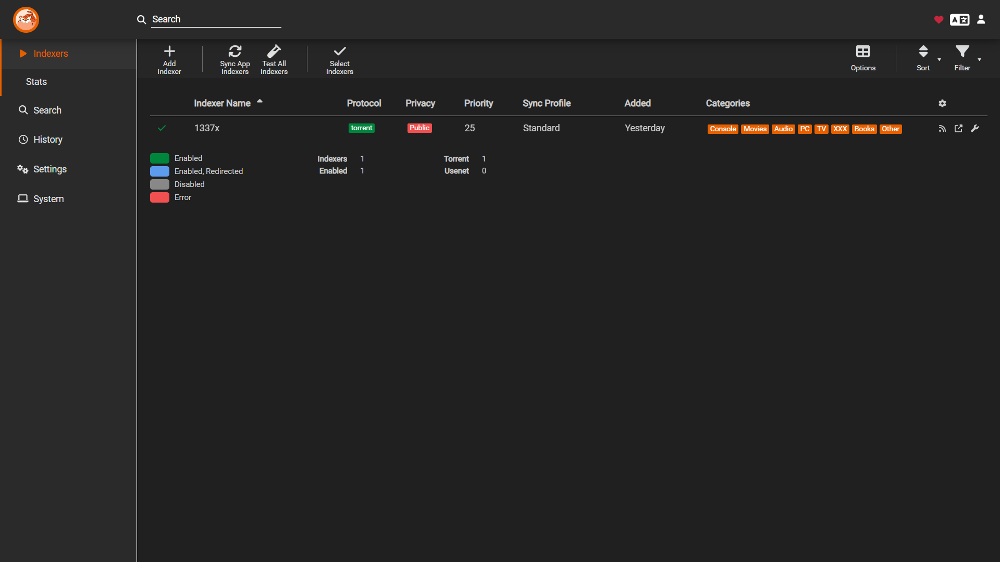
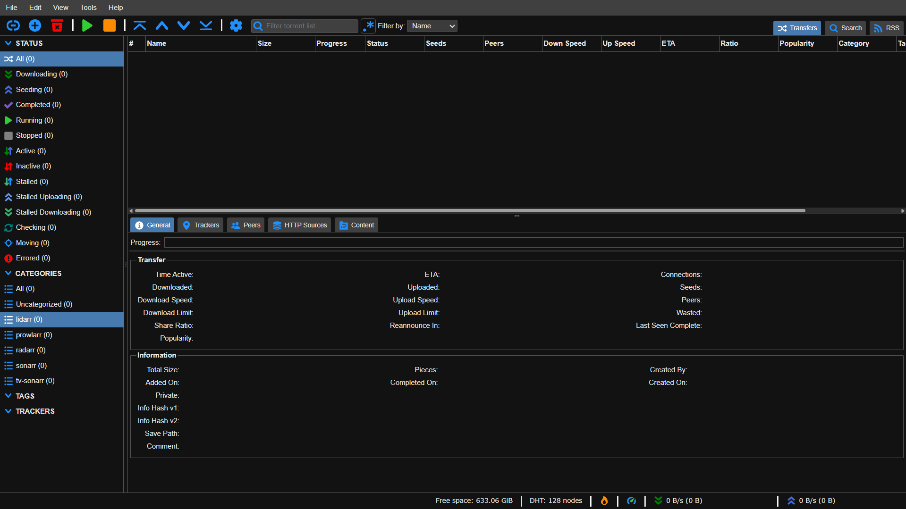

# 🏠 Automated Media Server Stack

[](https://www.docker.com/)
[](https://jellyfin.org/)
[](https://github.com/qdm12/gluetun)
[]()

### 🛡️ VPN-Protected | ⚡ High-Performance | 🤖 Fully Automated



---

## 📖 Overview

This repository contains a **production-ready** Docker Compose configuration for a complete media ecosystem. It is architected for privacy and performance using a **"Split-Network" Strategy**.

### ✨ Key Features
*   **🔒 Complete Privacy**: Indexers and metadata collectors run behind a VPN kill-switch (Gluetun).
*   **🚀 Native Performance**: Local streaming (Jellyfin) and requests (Jellyseerr) bypass the VPN for maximum speed.
*   **🤖 Full Automation**: Seamless "Arr" stack integration for hands-free media management.
*   **📊 Unified Dashboard**: Centralized management via Homepage.

---

## 🏗️ Architecture

The system is divided into two isolated network zones to balance security and speed:



*   **🔒 Privacy Zone (Behind Gluetun):** All "Arr" applications (**Radarr, Sonarr, Lidarr, Prowlarr**) and **FlareSolverr** are routed through **Gluetun**. This masks your traffic from your ISP and prevents metadata/indexer tracking.
*   **🚀 Performance Zone (Local ISP):** **Homepage**, **Jellyseerr**, **Jellyfin**, and **qBittorrent** run on the standard Docker bridge network. This ensures posters load instantly, 4K streams aren't throttled by VPN overhead, and downloads utilize your full bandwidth.

---

## 📸 Interface Gallery

| **Jellyfin (Media Player)** | **Jellyseerr (Discovery)** |
|:---:|:---:|
|  |  |
| **Radarr (Movies)** | **Sonarr (TV Shows)** |
|  |  |
| **Prowlarr (Indexers)** | **qBittorrent (Downloads)** |
|  |  |

---

## 🚀 Getting Started

### Prerequisites
*   **Docker** & **Docker Compose** installed.
*   A **ProtonVPN** account (or compatible OpenVPN provider).

### Installation

1.  **Clone the Repository**
2.  **Create Environment File**
    Create a `.env` file in the root directory to manage your paths and VPN credentials.
    ```bash
    # --- Path & System Settings ---
    DATA_LOCATION=D:/Docker/jellyfin/data
    TIMEZONE=Asia/Kolkata
    
    # --- ProtonVPN Credentials ---
    OPENVPN_USER=your_user
    OPENVPN_PASSWORD=your_password
    ```
3.  **Deploy the Stack**
    ```bash
    docker-compose up -d
    ```

---

## 📂 Directory Structure

To ensure **"Atomic Moves"** configuration works correctly, the stack follows this layout:

```text
D:\Docker\jellyfin
├── .env                  # Environment variables
├── docker-compose.yml    # Core stack configuration
├── check_stack.ps1       # Windows Health Script
├── check_stack.sh        # Linux/macOS Health Script
├── data/                 # Unified Media Storage
│   ├── downloads/        # Active & Seeding torrents
│   │   ├── movies/
│   │   ├── music/
│   │   └── shows/
│   └── media/            # Organized Library (Jellyfin/Arrs)
│       ├── movies/       # Organized by Radarr
│       ├── music/        # Organized by Lidarr
│       └── shows/        # Organized by Sonarr
├── homepage/             # Dashboard configuration
│   └── config/           # services.yaml & widgets.yaml
├── gluetun/              # VPN config & logs
├── jellyfin-config/      # Server metadata
├── jellyseerr/           # Request database
└── [radarr|sonarr|...]   # App-specific configs
```

---

## 🌐 Connectivity & Service Map

### 🔗 Critical Connection Logic
Because apps live in different network contexts, you **must** use these specific hostnames in their respective Web UIs:

| Connection Type | Target Service | Hostname to Use | Port |
| :--- | :--- | :--- | :--- |
| **Inside VPN ⮕ Host IP** | qBittorrent / Jellyfin | `host.docker.internal` | `8701` / `8096` |
| **Inside VPN ⮕ Inside VPN** | Prowlarr ⮕ FlareSolverr | `127.0.0.1` | `8191` |
| **Bridge ⮕ Inside VPN** | Jellyseerr ⮕ Radarr | `gluetun` | `7878` |
| **Bridge ⮕ Bridge** | Jellyseerr ⮕ Jellyfin | `jellyfin` | `8096` |
| **Dashboard ⮕ Apps** | Homepage ⮕ Radarr | `http://gluetun:7878` | `7878` |

### 🔍 Service Port Overview

| Service | Port | Access URL | Role |
| :--- | :--- | :--- | :--- |
| **Homepage** | `3000` | [http://localhost:3000](http://localhost:3000) | **Master Dashboard** |
| **Jellyseerr** | `5055` | [http://localhost:5055](http://localhost:5055) | User Requests |
| **Jellyfin** | `8096` | [http://localhost:8096](http://localhost:8096) | Media Server |
| **qBittorrent** | `8701` | [http://localhost:8701](http://localhost:8701) | Downloader |
| **Prowlarr** | `9696` | [http://localhost:9696](http://localhost:9696) | Indexer Manager |
| **Radarr** | `7878` | [http://localhost:7878](http://localhost:7878) | Movie Manager |
| **Sonarr** | `8989` | [http://localhost:8989](http://localhost:8989) | TV Show Manager |

---

## 🛠️ Operations & Maintenance

### 🩺 Health Check
Verify your VPN "Kill-Switch" and connectivity:

*   **Windows (PowerShell)**:
    ```powershell
    ./check_stack.ps1
    ```
*   **Linux/macOS**:
    ```bash
    chmod +x check_stack.sh && ./check_stack.sh
    ```

### 💾 Backup & Recovery
Back up the `.db` and `.xml` files within the app config directories (`./radarr`, `./sonarr`, etc.).
*   **Manual Backup (Windows)**:
    ```powershell
    Compress-Archive -Path .\radarr, .\sonarr, .\prowlarr, .\jellyseerr, .\jellyfin-config -DestinationPath .\backup_configs.zip
    ```

### 🔧 Troubleshooting Features
*   **TMDB Metadata Errors:** Ensure Jellyseerr is **not** behind the VPN.
*   **Cloudflare Errors:** In Prowlarr, route indexers through FlareSolverr (`http://127.0.0.1:8191`).
*   **Missing Posters:** Verify Jellyseerr connects to Jellyfin via `http://jellyfin:8096`.
* **Kill-Switch Confirmation:**
```bash
# Check VPN IP (Should be ProtonVPN)
docker exec gluetun wget -qO- https://api.ipify.org

# Check Local ISP IP (Should be your ISP)
docker exec qbittorrent wget -qO- https://api.ipify.org

```